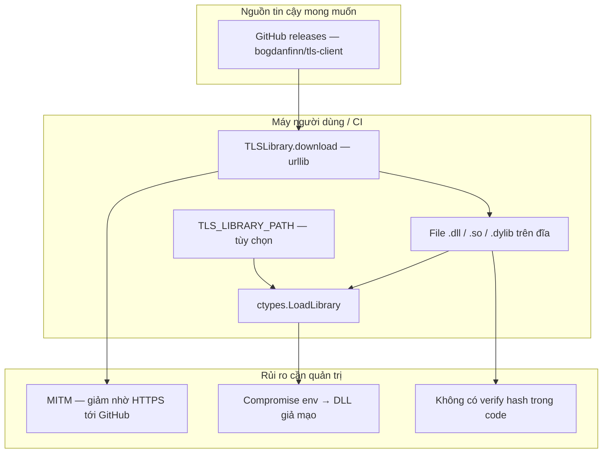
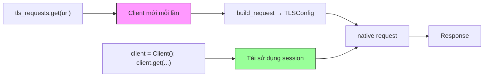

# Code review — tls-requests (`wrapper-tls-requests`)

Đợt review tập trung **chất lượng mã**, **bảo mật**, **hiệu năng** và **thực hành Python**. Ngôn ngữ: **Python 3.8+** (theo `pyproject.toml`). Repo là **thư viện client HTTP**, không phải ứng dụng có DB hay phân quyền server — **SQL injection** và **lỗi phân quyền kiểu web app** không áp dụng; phần Security mô tả rủi ro **phù hợp** với thư viện mạng/TLS.

---

## 1. Code quality

### 1.1 Trùng lặp (DRY)

| Vấn đề | Chi tiết | Mức độ |
|--------|----------|--------|
| **Sync vs async** | `Client` và `AsyncClient` trong `client.py` lặp lại gần như toàn bộ verb HTTP (`get`, `post`, …) và luồng `send` / `_send`. | Trung bình — có thể giảm drift bằng helper nội bộ (không bắt buộc). |
| **API module** | `api.py` lặp chữ ký cho từng verb rồi gọi `request` — **có chủ đích** (API giống `requests`). | Thấp. |
| **Định dạng chuỗi** | Trộn `%`, `str %` và f-string trên nhiều file. | Thấp — đồng nhất style (ruff/format) là đủ. |

### 1.2 Độ phức tạp / refactor gợi ý

- **`models/urls.py` — `URL`**: `_prepare`, sửa IPv6, gộp query — **dài, nhiều nhánh**. Nên tách hàm thuần + giữ/giành test trong `tests/test_urls.py`.
- **`models/libraries.py` — `TLSLibrary`**: Fetch release GitHub, fallback URL, tải file, `load` — **nhiều trách nhiệm**. Tách module nhỏ giúp audit và test độc lập.
- **`client.py` — `_rebuild_redirect_url`**: Đổi scheme / HTTP2 / session — nhạy; mọi thay đổi nên đi kèm `tests/test_redirects.py`.

### 1.3 Hooks — hành vi và tên biến

Trong `BaseClient.build_hook_request` / `build_hook_response`, vòng lặp **return ngay khi gọi hook đầu tiên** — chỉ **một** callable trong danh sách thực sự được thực thi (hook sau không chạy). Khác nhiều thư viện “chuỗi hook” chạy lần lượt. **Nên ghi rõ trong docs** (`docs/advanced/hooks.md`) để tránh hiểu nhầm; nếu muốn hành vi pipeline thì phải **thiết kế lại** (có thể breaking change).

`build_hook_response` dùng biến tên `request_hooks` dù đang lấy key `"response"` — **dễ gây nhầm khi đọc**; đổi tên cục bộ (ví dụ `response_hooks`) cải thiện bảo trì.

---

## 2. Security

### 2.1 Không phát hiện điểm điển hình như SQLi / RBAC

Không có truy vấn SQL hay model phân quyền trong repo.

### 2.2 Rủi ro / điểm cần ý thức

| Chủ đề | Mô tả |
|--------|--------|
| **Tải và nạp binary** | `TLSLibrary` có thể tải `tls-client` từ GitHub (HTTPS) và nạp bằng `ctypes.cdll.LoadLibrary`. **Không thấy xác minh hash/signature** so với giá trị đã biết — mức tin cậy phụ thuộc TLS + GitHub; trong môi trường **rất nhạy cảm** có thể cân nhắc mirror nội bộ + kiểm tra hash. |
| **`TLS_LIBRARY_PATH`** | Cho phép trỏ tới **bất kỳ file native** nào. Nếu biến môi trường bị kẻ tấn công chỉnh (hoặc CI bị compromise), có thể nạp DLL/SO độc hại. **Chỉ đặt từ nguồn tin cậy**; document rõ ràng. |
| **`verify=False` / `insecureSkipVerify`** | Truyền xuống TLS config (`models/tls.py`) — **tắt xác minh chứng chỉ** là footgun chuẩn của client HTTP; dùng chỉ khi debug/kịch bản đặc biệt có kiểm soát. |
| **Thông tin nhạy cảm trên log** | Logger ghi đường dẫn thư viện, URL tải; không thấy ghi body/auth có chủ đích. Bật **debug** trên thư viện native có thể lộ thêm tùy bản build — kiểm tra tài liệu `tls-client`. |
| **Proxy URL** | Chuỗi proxy có thể chứa user/password — tránh in `repr` đối tượng chứa URL đầy đủ ra log trong mã ứng dụng người dùng (không phải lỗi cốt lõi thư viện nếu không log). |
| **`importlib` / JSON** | `utils.import_module` chỉ cho charset/orjson — không load mã tùy ý từ input người dùng. Payload tới native là dict đã cấu trúc — **không** dùng `pickle` cho request path chính; `cookies` có đề cập pickle trong docstring (jar) — nếu app pickle cookie từ nguồn không tin cậy vẫn là rủi ro phía ứng dụng. |

---

## 3. Performance

| Điểm | Chi tiết |
|------|----------|
| **API cấp module** | `api.request` / `tls_requests.get` tạo `Client` trong `with` **mỗi lần gọi** — không tái sử dụng session/TLS. Nhiều request nhỏ → overhead tạo/hủy client và session native. **Khuyến nghị:** dùng **một** `Client()` hoặc `AsyncClient()` sống lâu cho workload bùng nổ. |
| **Đồng bộ I/O trong async** | `TLSClient.arequest` gọi native; cần xác nhận không block event loop quá lâu (phụ thuộc triển khai `arequest` — hiện bọc qua `_aread`). Nếu backend vẫn blocking, tài liệu nên nói rõ. |
| **Body lớn** | `Request.read` / encoders chunk theo `CHUNK_SIZE` — ổn; bottleneck thường là **mạng và native**, không phải Python thuần. |
| **Redirect** | `_send` đệ quy theo chuỗi redirect — số bước giới hạn bởi `max_redirects`; hợp lý. |

---

## 4. Best practices (Python)

| Tiêu chí | Đánh giá ngắn |
|----------|----------------|
| **PEP 8 / formatter** | Có `ruff` (E4, E7, E9, F, I), line 120 — phù hợp. |
| **Typing** | `from __future__ import annotations`, gợi ý kiểu rộng; `mypy` `disallow_untyped_defs = false` — chấp nhận được cho thư viện nhưng có thể siết dần `src/`. |
| **Tests** | Pytest + coverage trong CI — tốt. |
| **Dependencies** | Ít dependency runtime (`idna`, `charset-normalizer`, `orjson`) — tốt cho supply chain. |
| **Tài liệu** | MkDocs, README rõ — tốt. |

Một số chỗ dùng `%` thay vì f-string — không sai, chỉ không đồng nhất.

---

## 5. Sơ đồ Mermaid

### 5.1 Mặt tấn công / supply chain (góc nhìn thư viện)

### 5.2 Luồng xử lý request và điểm hiệu năng

**Chú thích:** nhánh `tls_requests.get` tạo client mỗi lần (hồng) thường chậm hơn so với giữ `Client` (xanh) khi gọi lặp.

---

## 6. Kết luận

- **Chất lượng:** Cấu trúc tách `models` / `client` / `tls` rõ; trùng lặp sync/async là điểm cải thiện dài hạn; hooks cần **tài liệu hóa hành vi** (chỉ hook đầu chạy) và có thể **đổi tên biến** trong `build_hook_response`.
- **Bảo mật:** Tập trung **chuỗi cung ứng binary** và **`TLS_LIBRARY_PATH`**, cùng **`verify`**. Không có SQL/RBAC.
- **Hiệu năng:** Ưu tiên **Client tái sử dụng** cho workload nhiều request.
- **Best practices:** Phù hợp dự án Python hiện đại; có thể tăng độ chặt typing theo thời gian.

*Tài liệu này là đánh giá tĩnh tại thời điểm review; không thay thế audit chuyên sâu hoặc fuzzing.*
