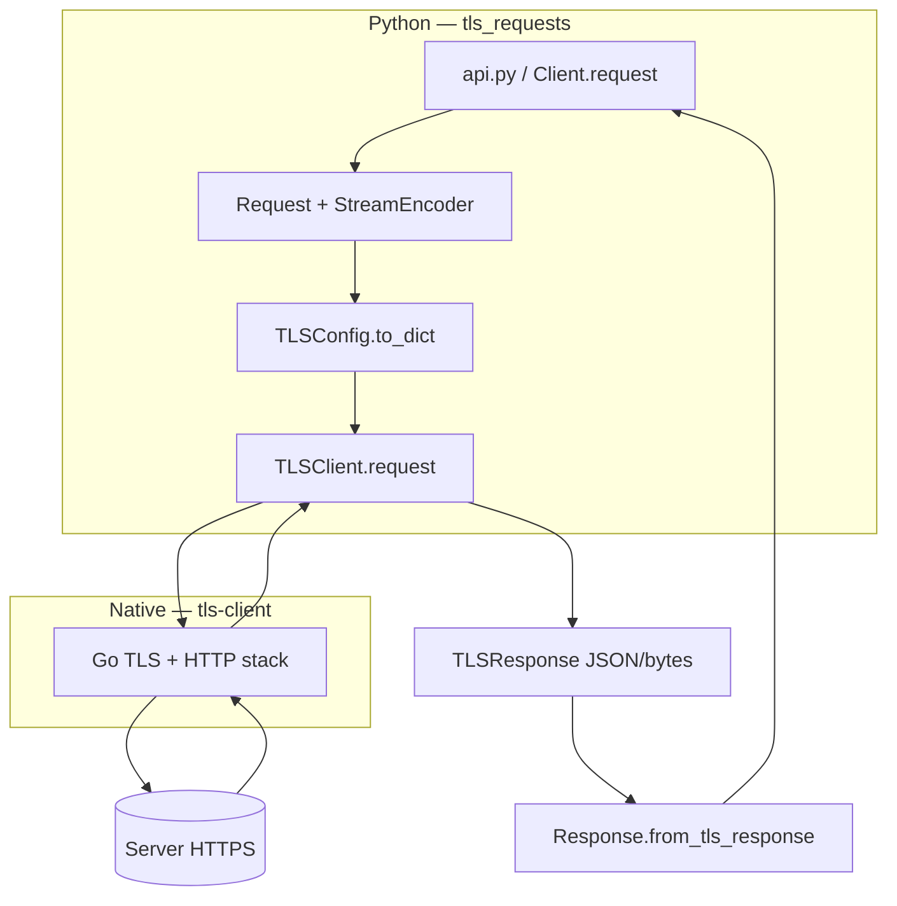
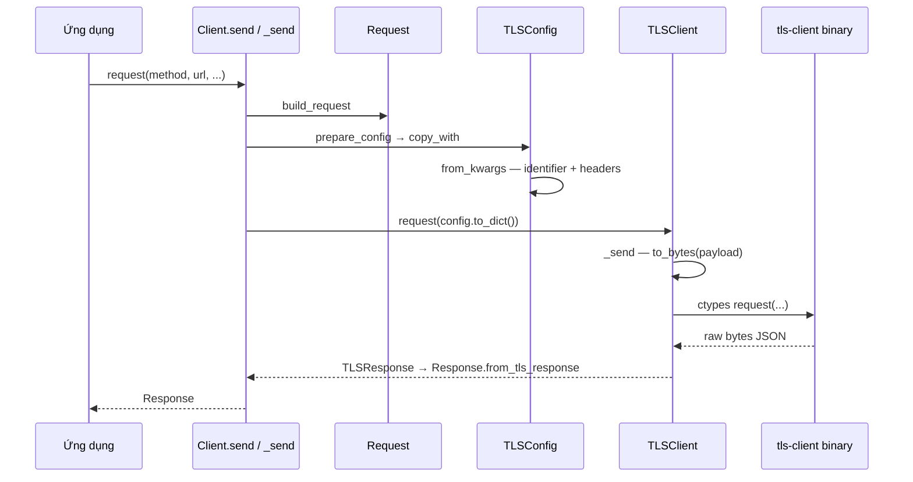
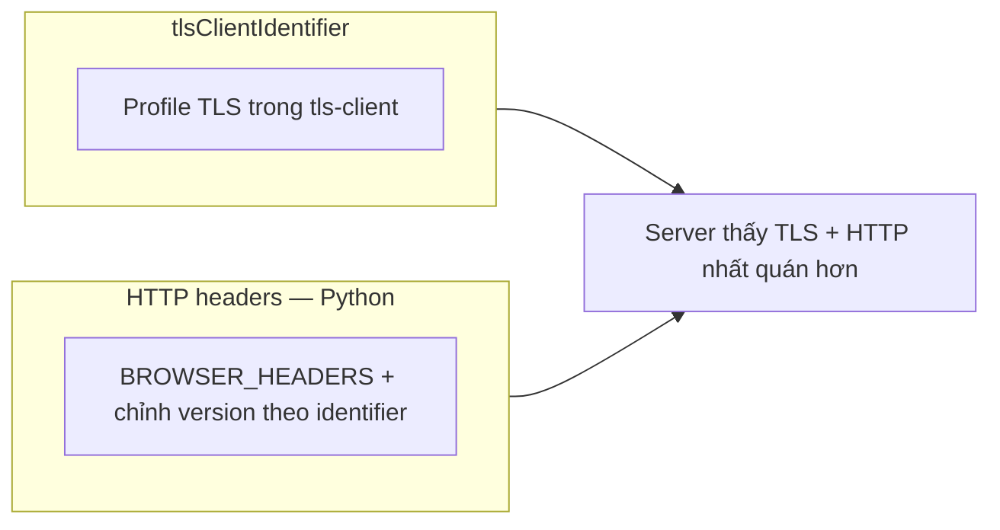

# Nguyên tắc cốt lõi và luồng hoạt động — tls-requests

Tài liệu mô tả **vì sao** repo hoạt động theo cách hiện tại, **các file/hàm** nằm trên luồng chính, khả năng **port sang Bun/TypeScript**, và **sơ đồ Mermaid**.

---

## 1. Nguyên tắc cốt lõi — tại sao lại như vậy?

### 1.1 Vấn đề cần giải quyết

Nhiều client HTTP trong Python (và stack TLS mặc định như OpenSSL) tạo ra **TLS fingerprint** (ví dụ thứ tự extension, cipher suite, hành vi HTTP/2) **khác trình duyệt thật**. Dịch vụ phía server (CDN, WAF, anti-bot) có thể so khớp fingerprint với User-Agent và **từ chối** các client “giống bot/script”.

### 1.2 Hướng giải của repo này

Repo **không tự implement TLS** trong Python. Nó là **lớp bọc (wrapper)** quanh thư viện native **[bogdanfinn/tls-client](https://github.com/bogdanfinn/tls-client)** (Go, đóng gói thành `.dll` / `.so` / `.dylib`):

1. **tls-client** tái tạo handshake và stack HTTP **sát với profile trình duyệt** được chọn (Chrome, Firefox, Safari, …) — đây là phần “cốt lõi” về mặt mạng/TLS.
2. **tls-requests** (Python) chuẩn bị **payload cấu hình** (URL, method, headers, body, proxy, `tlsClientIdentifier`, session, …), gọi hàm `request` trong binary qua **`ctypes`**, nhận **JSON/bytes** phản hồi rồi chuyển thành đối tượng `Response` quen thuộc với lập trình viên Python.

**Tóm lại:** Hoạt động “đúng” vì **hành vi TLS/HTTP giống browser nằm ở Go**, Python chỉ **điều phối** và **mapping dữ liệu**.

### 1.3 Hai lớp “giống trình duyệt” trong code Python

| Lớp | Ý nghĩa |
|-----|---------|
| **`tlsClientIdentifier`** | Chọn **profile TLS** (cipher, extension order, ALPN, …) bên trong tls-client — đây là phần chống fingerprint mạnh nhất. |
| **Header mặc định** (`BROWSER_HEADERS` trong `settings.py`) | Khi không truyền header tùy chỉnh, `TLSConfig.from_kwargs` **bơm User-Agent / sec-ch-ua / …** khớp loại browser suy ra từ chuỗi identifier (và chỉnh version theo regex `chrome_133`, v.v.) — giúp **HTTP headers** nhất quán với profile TLS. |

Chi tiết inject header theo identifier: `TLSConfig.from_kwargs` trong `models/tls.py` (khoảng dòng 598–638).

---

## 2. Có thể chuyển sang Bun + TypeScript không?

### 2.1 Bun `fetch` thuần — **không** thay thế trực tiếp

`fetch` của Bun/Node dùng stack TLS của runtime — **không** bắt chước fingerprint của Chrome 133 như tls-client. Đổi ngôn ngữ sang TS **mà chỉ viết `fetch(url)`** sẽ **mất** tính năng cốt lõi (trừ khi server không kiểm fingerprint).

### 2.2 Các hướng khả thi nếu muốn TypeScript/Bun

| Hướng | Mô tả |
|-------|--------|
| **FFI tới cùng binary tls-client** | Binary xuất API kiểu C (`request`, `destroySession`, …). Bun có [FFI](https://bun.sh/docs/api/ffi); cần định nghĩa kiểu và serialize payload giống Python (`to_bytes` → JSON string đưa vào hàm native). **Khả thi về mặt kỹ thuật**, công việc là binding + test đa nền tảng. |
| **Gọi tiến trình / IPC** | Nếu có CLI hoặc service trung gian đọc JSON — tránh FFI nhưng tốn overhead và triển khai. |
| **Thư viện TS khác** | Ví dụ binding **curl-impersonate** hoặc giải pháp impersonate khác — **không** trùng 1:1 với tls-client nhưng cùng ý tưởng “TLS giống browser”. |

**Kết luận:** Chuyển **logic điều phối** (Request/Response, redirect, cookie) sang TypeScript/Bun **được**; phần **TLS giống browser** vẫn phụ thuộc **native** (tls-client hoặc tương đương), không phải “viết lại bằng TS thuần”.

---

## 3. File và hàm trên luồng chính

Luồng: **ứng dụng → Client → Request / TLSConfig → TLSClient (ctypes) → binary → Response**.

| File | Hàm / thành phần | Vai trò |
|------|------------------|---------|
| `api.py` | `request`, `get`, `post`, … | API cấp module; tạo `Client` và gọi `client.request`. |
| `client.py` | `BaseClient.__init__` | `TLSClient.initialize()`, `TLSConfig.from_kwargs(...)`. |
| `client.py` | `BaseClient.build_request` | Tạo `Request` (URL, body, headers, cookies, proxy). |
| `client.py` | `BaseClient.prepare_config` | `TLSConfig.copy_with(...)` — map request → payload gửi native (gán `request._session_id` từ config). |
| `client.py` | `BaseClient._send` | `self.session.request(config.to_dict())` → `Response.from_tls_response(...)`, xử lý redirect. |
| `client.py` | `Client.send` | Auth, hooks, gọi `_send`, đọc body, `response.close()`. |
| `client.py` | `AsyncClient._send` / `arequest` | Phiên bản async của gọi native. |
| `models/request.py` | `Request.__init__`, `read` / `aread` | Chuẩn hóa URL, `StreamEncoder` cho body. |
| `models/tls.py` | `TLSLibrary.load`, `TLSLibrary.download` | Tìm/tải/nạp file `.dll`/`.so`/`.dylib`. |
| `models/tls.py` | `TLSClient.initialize` | `ctypes` bind `request`, `destroySession`, … |
| `models/tls.py` | `TLSClient.request`, `_send` | `fn(to_bytes(payload))` → `response(...)`. |
| `models/tls.py` | `TLSConfig.from_kwargs`, `to_dict`, `copy_with` | Build cấu hình tls-client; inject header theo `client_identifier`. |
| `models/tls.py` | `TLSResponse.from_bytes` | Parse JSON trả về từ native. |
| `models/response.py` | `Response.from_tls_response` | `TLSResponse` → `Response` Python (status, headers, body base64 nếu cần). |
| `utils.py` | `to_bytes` (dict → JSON), `to_json` | Serialize payload cho native. |

**Điểm giao với native (tối quan trọng):**

```191:192:src/tls_requests/models/tls.py
    def _send(cls, fn: Callable, payload: dict):
        return cls.response(fn(to_bytes(payload)))
```

```474:476:src/tls_requests/client.py
        response = Response.from_tls_response(
            self.session.request(config.to_dict()),
            is_byte_response=config.isByteResponse,
```

*(Đường dẫn dòng có thể lệch nhẹ theo phiên bản; tìm bằng tên hàm nếu cần.)*

---

## 4. Sơ đồ Mermaid

### 4.1 Luồng dữ liệu tổng quan



### 4.2 Chuỗi gọi hàm (đồng bộ)



### 4.3 Hai trụ cột “giống browser”



---

## 5. Tóm tắt một câu

**Repo hoạt động vì** nó ủy quyền **mô phỏng TLS/HTTP của trình duyệt** cho binary **tls-client (Go)**, còn Python chỉ **chuẩn bị payload, session, redirect, cookie và Response**; **chuyển sang Bun/TS** vẫn cần lớp **native tương đương** (FFI hoặc tiến trình), không thể thay bằng `fetch` thuần nếu mục tiêu vẫn là fingerprint giống Chrome/Firefox.
