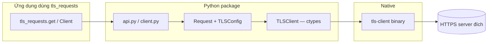
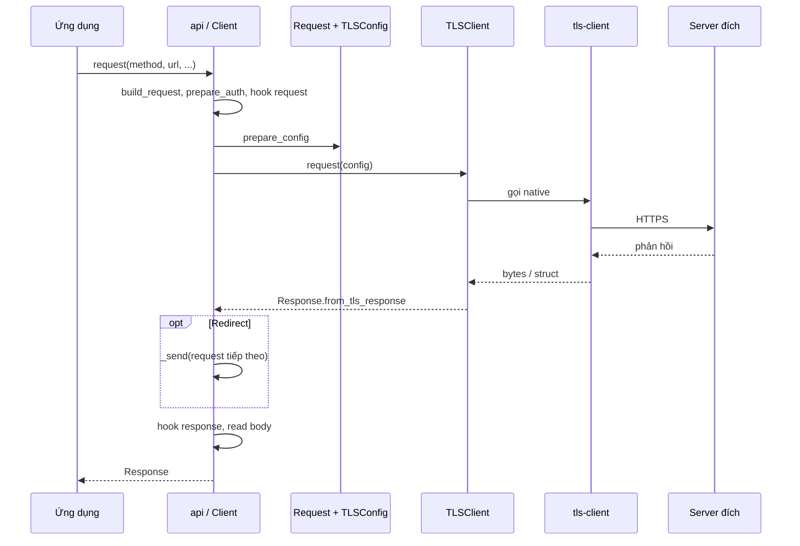

# Hướng dẫn thành viên mới — tls-requests

Tài liệu trả lời nhanh: repo làm gì, thư mục nào quan trọng, dữ liệu đi qua đâu, và stack kỹ thuật. Xem thêm phân tích kiến trúc sâu trong [`OVERVIEW.md`](OVERVIEW.md).

---

## 1. Chức năng chính của repo

**tls-requests** (gói PyPI: **`wrapper-tls-requests`**) là **thư viện Python** để gửi HTTP(S) với **TLS fingerprint giống trình duyệt** (dựa trên thư viện native **[tls-client](https://github.com/bogdanfinn/tls-client)** viết bằng Go). API thiết kế **tương tự [`requests`](https://github.com/psf/requests)** (`get`, `post`, `Client`, v.v.) nhưng lưu lượng thực tế đi qua binary TLS client, không qua `urllib3` mặc định.

Mục tiêu sử dụng điển hình: **scraping**, **client API** cần giả lập trình duyệt, hoặc giảm bị chặn bởi các cơ chế dựa trên **JA3/TLS fingerprint** và HTTP/2.

---

## 2. Cấu trúc thư mục và ý nghĩa

| Thư mục / file | Vai trò |
|-----------------|--------|
| **`src/tls_requests/`** | Mã nguồn thư viện: entry `__init__.py`, `api.py` (hàm cấp module), `client.py` (`Client`, `AsyncClient`), `models/` (request/response/TLS/URL/cookies…), `settings.py`, `types.py`, `utils.py`, `exceptions.py`. |
| **`src/tls_requests/bin/`** | Binary `tls-client` theo OS/kiến trúc và metadata (xem `models/libraries.py`) — có thể tải/ghi khi chạy lần đầu tùy môi trường. |
| **`tests/`** | Kiểm thử Pytest (client, TLS, proxy, redirect, hooks, encoders…). |
| **`docs/`** | Tài liệu MkDocs (quickstart, TLS, async, hooks, proxy). |
| **`mkdocs.yml`** | Cấu hình site tài liệu. |
| **`pyproject.toml`** | Metadata gói, dependencies, công cụ (ruff, mypy, pytest). |
| **`.github/workflows/`** | CI, release, publish package và documentation. |

Đây **không** phải repo backend có REST API: không có “endpoint” HTTP nội bộ. “API” ở đây là **API công khai của thư viện Python** (`tls_requests.get`, `Client.request`, …).

---

## 3. Luồng dữ liệu chính (từ đâu đến đâu)

Luồng không phải `HTTP request → server repo` mà là **chuỗi trong process Python**:

1. **Người dùng thư viện** gọi `tls_requests.get(...)` hoặc `Client().request(...)` / `AsyncClient`.
2. **`api.py`** (nếu dùng hàm module) tạo `Client` tạm, rồi gọi `client.request`.
3. **`client.py`**: `build_request` → đối tượng **`Request`**; `prepare_auth`, **hooks** `request`; `prepare_config` → **`TLSConfig`** (gắn session, header, body, proxy, `client_identifier`).
4. **`models/tls.py` — `TLSClient`**: gọi hàm native qua **`ctypes`** với payload (thường là dict đã serialize).
5. **Binary `tls-client`**: thực hiện TLS + HTTP thật tới **máy chủ đích trên Internet**.
6. Kết quả được bọc thành **`Response`** (`Response.from_tls_response`), xử lý **redirect** trong `_send` nếu bật `follow_redirects`, rồi **hooks** `response` và đọc body.

Tóm lại: **`Mã ứng dụng → tls_requests (Python) → TLSConfig → tls-client (native) → HTTPS tới URL đích`**.

---

## 4. Công nghệ, framework và thư viện cốt lõi

### Runtime (khai báo trong `pyproject.toml`)

| Thành phần | Ghi chú |
|------------|---------|
| **Python** | `>= 3.8` (README/badge thường nhắc 3.9+). |
| **idna** | Chuẩn hóa IDN / hostname. |
| **charset-normalizer** | Phát hiện encoding nội dung phản hồi. |
| **orjson** | Serialize/parse JSON hiệu năng cao khi cần. |
| **tls-client** (binary) | Không phải gói pip; tải/nạp từ `TLSLibrary` trong `models/libraries.py`, upstream **bogdanfinn/tls-client**. |

### Phát triển & chất lượng (nhóm `dev`)

pytest, pytest-asyncio, pytest-httpserver, pytest-cov, werkzeug, tox, pre-commit, ruff, mypy, mkdocs, mkdocs-material, mkdocstrings.

### Build

hatchling, uv-dynamic-versioning (phiên bản động khi build).

---

## 5. Sơ đồ Mermaid

### 5.1 Luồng tổng quan (thư viện → native → mạng)

### 5.2 Trình tự chi tiết (một request đồng bộ)

---

## 6. Bước tiếp theo

- Đọc [`README.md`](README.md) và [tài liệu online](https://thewebscraping.github.io/tls-requests/).
- Chạy test: `pytest` (sau khi cài nhóm dev, ví dụ `uv sync --group dev` hoặc `pip install -e ".[dev]"` tùy cách bạn cài đặt).
- Phân tích kiến trúc thêm: [`OVERVIEW.md`](OVERVIEW.md).
