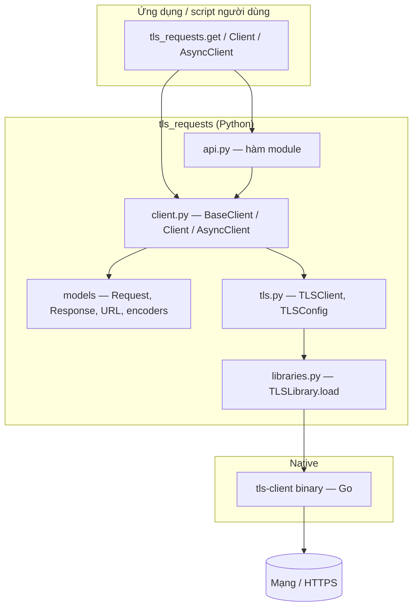
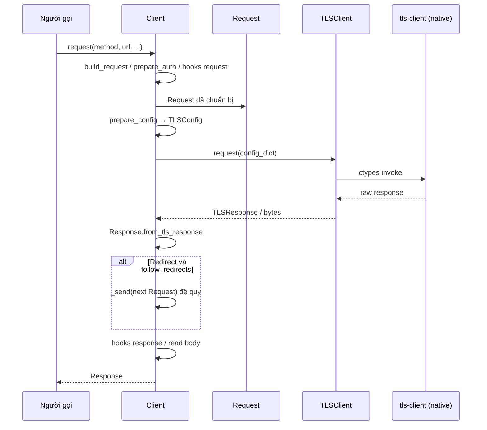
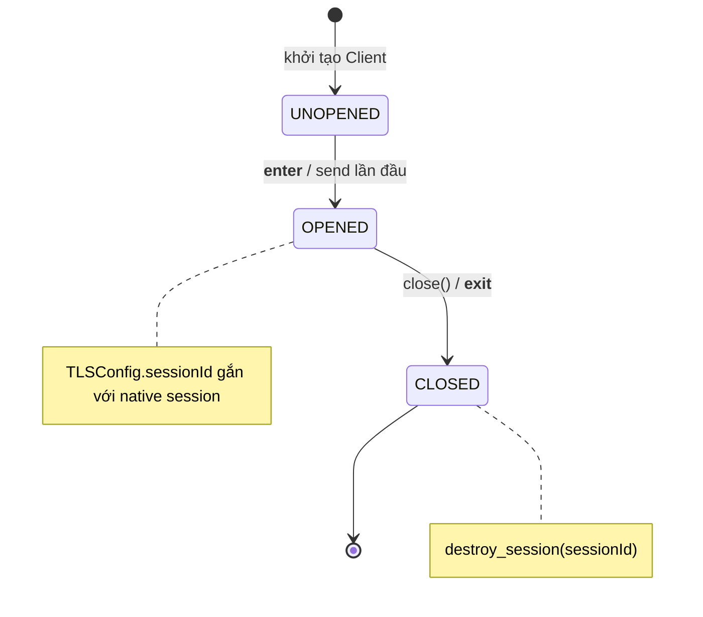

# TLS Requests — Tổng quan dự án

Tài liệu này tổng hợp phân tích repository **tls-requests** (gói PyPI: `wrapper-tls-requests`) theo ba góc nhìn: kiến trúc, triển khai và sản phẩm, kèm sơ đồ Mermaid mô tả luồng hoạt động.

---

## 1. Kiến trúc sư phần mềm

### 1.1 Bản chất hệ thống

Đây là **thư viện client HTTP cho Python**, không phải ứng dụng web hay dịch vụ có API endpoint. Luồng chính là: **mã ứng dụng Python → lớp client → binding native (Go `tls-client`) → mạng/TLS**.

Thiết kế theo **lớp (layered)** và **adapter**:

| Lớp | Vai trò |
|-----|---------|
| **API module** (`api.py`) | Hàm cấp module `get`, `post`, `request`, … giống `requests`, tạo `Client` tạm thời trong `with` rồi gửi một request. |
| **Client** (`client.py`) | `BaseClient` / `Client` / `AsyncClient`: quản lý session TLS, hợp nhất header/cookie/proxy, redirect, hooks. |
| **Mô hình** (`models/`) | `Request`, `Response`, `URL`, encoders — chuẩn hóa dữ liệu trước/sau khi gọi backend. |
| **TLS** (`models/tls.py`, `models/libraries.py`) | `TLSClient` gọi thư viện native qua `ctypes`; `TLSLibrary` tải/nạp binary `tls-client` (theo platform). |
| **Cấu hình** (`settings.py`) | Giá trị mặc định (timeout, `client_identifier`, header trình duyệt). |

### 1.2 Pattern kiến trúc

- **Facade**: `tls_requests.get(...)` và `Client` che giấu chi tiết `TLSConfig`, session id, và gọi native.
- **Adapter**: `TLSClient` thích ứng API Python với contract của thư viện Go (payload JSON/bytes, session destroy, free memory).
- **Strategy (xoay vòng)**: `ProxyRotator`, `TLSIdentifierRotator`, `HeaderRotator` — chọn proxy/header/TLS profile theo từng request.
- **Template method**: Luồng `build_request` → `prepare_*` → `send` → `_send` lặp lại cho sync/async với biến thể nhỏ (`arequest`, `aprepare_*`).

### 1.3 Khả năng mở rộng

- **Hooks** (`request` / `response`): mở rộng logging, metrics, chỉnh sửa request/response mà không đổi core TLS.
- **`client_identifier` và TLS config**: đổi fingerprint trình duyệt mà không fork thư viện.
- **Phụ thuộc binary**: phiên bản `tls-client` được ghim (`LATEST_VERSION_TAG_NAME` trong `libraries.py`); nâng cấp cần đồng bộ API native.
- **Async**: `AsyncClient` song song với `Client`, dùng chung logic chuẩn bị request và `TLSConfig`.

### 1.4 Rủi ro / giới hạn kiến trúc

- Hiệu năng và hành vi TLS phụ thuộc **hoàn toàn** vào binary `tls-client`; Python chỉ orchestrate.
- Triển khai đa nền tảng phụ thuộc **tải đúng** thư viện native (Windows/Linux/macOS, kiến trúc CPU).

---

## 2. Lập trình viên

### 2.1 Cấu trúc thư mục

| Đường dẫn | Ý nghĩa |
|-----------|---------|
| `src/tls_requests/` | Mã nguồn chính: `api`, `client`, `exceptions`, `settings`, `types`, `utils`, `models/`. |
| `src/tls_requests/bin/` | (Theo `libraries.py`) Thư mục chứa binary TLS client và metadata tải về. |
| `tests/` | Pytest: client, TLS, proxy, redirect, hooks, encoders, v.v. |
| `docs/` | MkDocs Material: quickstart, TLS, async, hooks, proxies. |
| `.github/workflows/` | CI, release, publish docs. |

### 2.2 Luồng dữ liệu chính (không có “REST API” nội bộ)

1. Người gọi: `tls_requests.get(url)` hoặc `Client().request(...)`.
2. `build_request` / `abuild_request` tạo `Request` (URL, body qua `StreamEncoder`, headers).
3. `prepare_config` sinh `TLSConfig` (body, headers, cookies, proxy, `client_identifier`, session id).
4. `TLSClient.request` / `arequest` → native.
5. `Response.from_tls_response` bọc kết quả; xử lý redirect đệ quy trong `_send`; hooks sau response; `read()` / `close()`.

### 2.3 Thư viện cốt lõi (runtime)

Theo `pyproject.toml`:

- **idna**: Chuẩn hóa tên miền quốc tế.
- **charset-normalizer**: Gợi ý encoding cho nội dung phản hồi.
- **orjson**: Tuần tự hóa JSON hiệu năng cao khi cần.

**Ngoài PyPI**: thư viện native **[bogdanfinn/tls-client](https://github.com/bogdanfinn/tls-client)** (Go), nạp qua `ctypes` trong `TLSLibrary` / `TLSClient`.

### 2.4 Công cụ phát triển

pytest, pytest-asyncio, pytest-httpserver, ruff, mypy, mkdocs-material, pre-commit, tox (nhóm `dev` trong `pyproject.toml`).

### 2.5 Bảo trì

- Code tách **models** khỏi **I/O TLS** — dễ test encoders/URL/header riêng.
- `Client` và `AsyncClient` trùng lặp có chủ đích (sync vs async); khi sửa logic redirect hoặc hook cần kiểm tra cả hai nhánh.
- Typing: `types.py` tập trung alias; mypy cho phép `ignore_missing_imports` toàn cục — có thể siết dần theo module.

---

## 3. Quản lý sản phẩm

### 3.1 Mục đích dự án

Cung cấp **HTTP client Python** có **TLS fingerprint giống trình duyệt**, hỗ trợ kịch bản **web scraping**, **tích hợp API** hoặc **vượt một số lớp chống bot** (ví dụ fingerprint TLS/HTTP2), với API quen thuộc kiểu `requests`.

### 3.2 Tính năng chính (giá trị người dùng)

- Chọn **profile TLS** qua `client_identifier` (mặc định ví dụ `chrome_133`), đồng bộ User-Agent / `sec-ch-ua` từ cấu hình.
- **HTTP/2**, **protocol racing**, timeout, redirect có giới hạn.
- **Proxy** (HTTP/SOCKS) và **xoay proxy** có trọng số / vùng (theo README và `ProxyRotator`).
- **Cookie**, **Basic/Auth tùy chỉnh**, upload file, JSON/form.
- **Hooks** request/response cho observability.
- **Đồng bộ và bất đồng bộ** (`Client` / `AsyncClient`).

### 3.3 Luồng người dùng điển hình

1. Cài `wrapper-tls-requests` (và đảm bảo binary TLS tải/đặt đúng trên máy dev/CI).
2. `import tls_requests`.
3. Một trong hai: gọi nhanh `tls_requests.get(url, client_identifier="...")` hoặc giữ `Client()` lâu dài để tái sử dụng cookie/cấu hình.
4. Đọc `response.text` / `response.json()`, xử lý lỗi (`raise_for_status`), tùy chọn xoay proxy hoặc đổi identifier khi bị chặn.

**Lưu ý pháp lý/đạo đức**: Sản phẩm có thể dùng để thu thập dữ liệu công khai hoặc tự động hóa; người dùng cuối chịu trách nhiệm tuân thủ ToS của site và luật địa phương.

---

## 4. Sơ đồ Mermaid

### 4.1 Kiến trúc tầng (tổng quan)

### 4.2 Luồng một request (đồng bộ)

### 4.3 Trạng thái client và session

---

## 5. Tóm tắt một dòng

**TLS Requests** là lớp bọc Python hiện đại quanh **tls-client (Go)**, mang API kiểu **requests**, nhấn mạnh **TLS fingerprinting**, **proxy/TLS rotation** và **async**, nhắm tới developer cần kết nối HTTP(S) tin cậy trong bối cảnh chống bot và fingerprint phía server.
